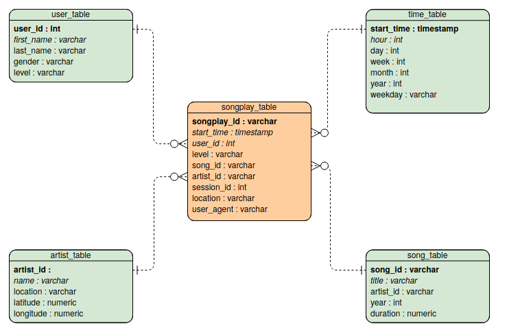

# Project Overview

Data Lakes project of the Data Engineering Udacity Nanodegree.  

## Introduction

At Sparkify, our app allows the user to stream music. Our user base and song database have grown and we want to move the data warehouse to a data lake.

Scope of this repo is to build an ETL Pipeline that 
- extracts data from S3
- processes them using Spark
- loads them back into S3 as a set of dimensional tables.

The Spark process is deployed on a cluster using AWS.

The DB schema is chosen to optimize the queries of our analytics team, whose task is to understand what songs users are listening to. 

## Dataset
Data reside in S3, in a directory of JSON logs on user activity on the app, as well as a directory with JSON metadata on the songs in their app. 

### Song Dataset
Sparkify song dataset (which truely is a subset of the real data from the [Million Song Dataset](http://millionsongdataset.com/)) consists of files in JSON format and contains metadata about a song and the artist of that song. The files are partitioned by the first three letters of each song's track ID. For example, here are filepaths to two files in this dataset.
```python
song_data/A/B/C/TRABCEI128F424C983.json
song_data/A/A/B/TRAABJL12903CDCF1A.json
```
And below is an example of what a single song file, TRAABJL12903CDCF1A.json, looks like.
```python
{"num_songs": 1, "artist_id": "ARJIE2Y1187B994AB7", "artist_latitude": null, "artist_longitude": null, "artist_location": "", "artist_name": "Line Renaud", "song_id": "SOUPIRU12A6D4FA1E1", "title": "Der Kleine Dompfaff", "duration": 152.92036, "year": 0}
```
### Log Dataset
The user activity dataset consists of log files from our music streaming app in JSON format generated by the Sparkify app (Truely: [event simulator](https://github.com/Interana/eventsim)) based on the songs in the dataset above. 

These log files are partitioned by year and month. For example, here are filepaths to two files in this dataset.
```python
log_data/2018/11/2018-11-12-events.json
log_data/2018/11/2018-11-13-events.json
```
And below is an example of what the data in a log file, 2018-11-12-events.json, looks like.


## Files 
The following files are needed for execution:
1. ```etl.py``` reads data from S3, processes that data using Spark, and writes them back to S3
2. ```dl.cfg``` (not included in this repo) contains your AWS credentials

Additionally, the file ```test.ipynb``` displays the first few rows of each table to check the database.

## Database Schema
The Database schema contains the following tables
#### Fact Table 
1. **songplays** - records in log data associated with song plays i.e. records with page ```NextSong```
* *songplay_id, start_time, user_id, level, song_id, artist_id, session_id, location, user_agent*
#### Dimenson Tables
2. **users** - users in the app 
* *user_id, first_name, last_name, gender, level*
3. **songs** - songs in music database
* *song_id, title, artist_id, year, duration
4. **artists** - artists in music database
* *artist_id, name, location, latitude, longitude*
5. **times** - timestamps of records in **songplays** broken down into specific units
* *start_time, hour, day, week, month, year, weekday
It is organised as a start schema, that simplifies queries about user activities. The Entity Relation Diagram is as follows


The diagram is generated using [Visual Paradigm](https://online.visual-paradigm.com/diagrams/features/erd-tool/). Primary keys are in bold font. I did not manage to do-undo italics to distinguish numerical entries...

## Usage

To execute the pipeline and create the database in your S3 bucket, 
- substitute your AWS_ACCESS_KEY_ID and AWS_SECRET_ACCESS_KEY in the file ```dl.cfg```
- create a cluster on AWS EMR
- substitute your s3 bucket path in the variable ```output_data```
- execute the file ```etl.py``` on the cluster

### ETL pipeline
The ETL pipeline consists of two main steps, executing the functions ```process_song_data``` and ```process_log_data```

#### Process Song Data
This function processes song data by iterating over the .json files in the input folder and creates ```songs``` and ```artists``` tables. Then writes the tables to the S3 bucket given in the ```output_data```.

The function 
- reads the ```.json``` files into a Spark DataFrame. 
- From this DataFrame, an SQL query extracts the table ```songs_table```. When writing to S3, the files are partitioned by year and artist.
- From the original DataFrame, an SQL query extracts the table ```artists_table```.

#### Process Log Data
This function processes log data by iterating over the .json files in the input folder and creates ```users```,```times``` and ```songplays``` tables. Then writes the tables to the S3 bucket given in the ```output_data```.

The function 
- reads the log activities stored in the ```.json``` files into a Spark DataFrame. 
- filters out the activity not related to songplay events.
- From this DataFrame, an SQL query extracts the table ```users_table```, dropping duplicate events to prevent double insertion. 
- To create the ```times_table```, from the timestamp, information are estracted regarding event time, year, month, day, weekday and hour. When writing to S3, the files are partitioned by year and month.
- To create the ```songplays``` table, also data from the ```.json```files of the song are read. These are then joined to data from the activity log, to create the songplays_table. Finally, to each row in this table a unique ID is assigned. When writing to S3, the files are partitioned by year and month.

### Queries
Here's a query for checking on which day of the week a specific song, displayed by title, was played
```
SELECT  s.title, t.weekday 
FROM songplays AS sp JOIN songs AS s ON sp.song_id=s.song_id
                        JOIN times AS t ON sp.start_time=t.start_time
                        LIMIT 1
```
This should return 
| title         | weekday       |
| ------------- |:-------------:| 
| If I Ain't Got You|Monday              |
